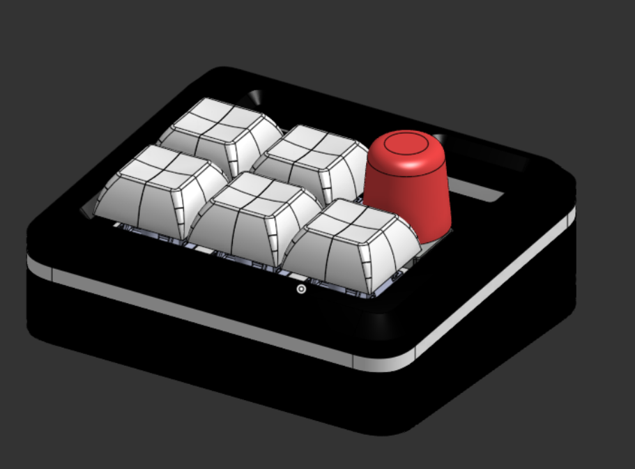
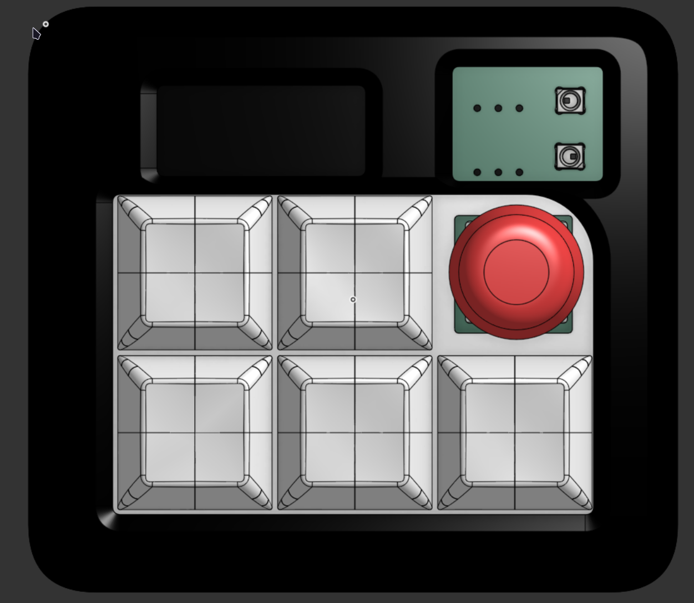
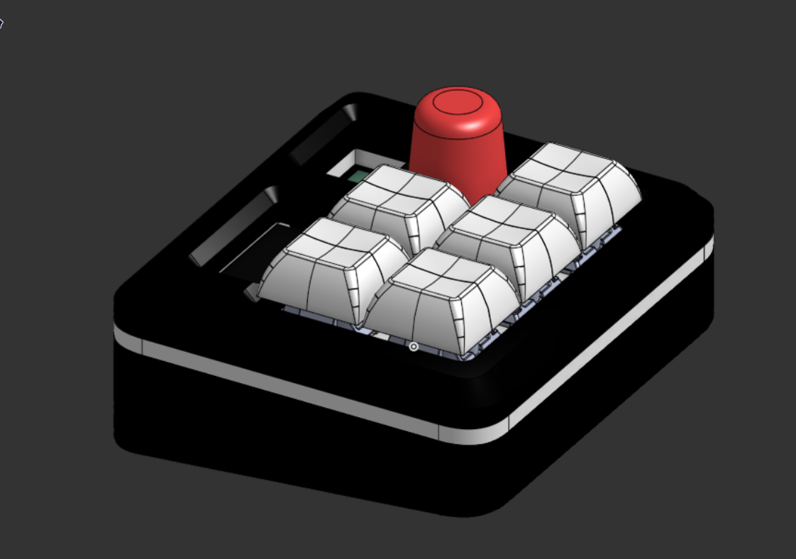
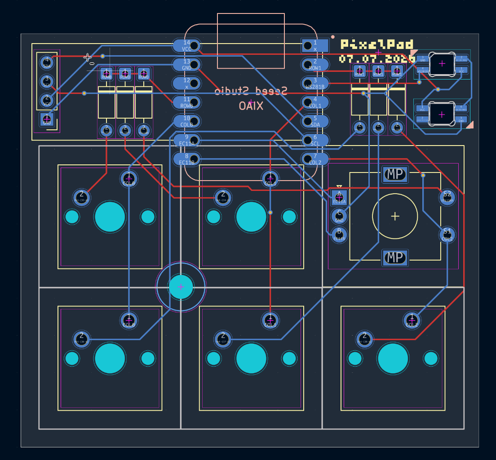
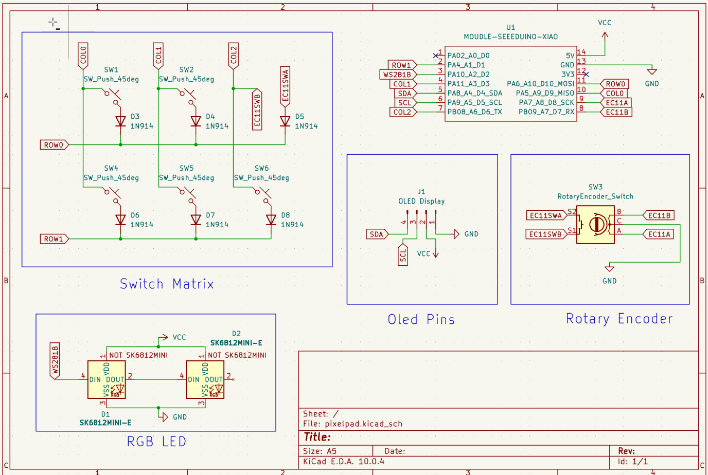

# PixelPad

PixelPad is a 5 key macropad with a rotary encoder, an OLED screen, and two LEDs. It's my first piece of hardware I've ever made (I don't count building a pc), so I'm really excited to use seomthing made by me. I tried to make it as compact as possible while still fitting everything.

It was made for the Hackclub organization's Hackpad YSWS. I took major inspiration from the example [OrpheusPad](https://github.com/hackclub/hackpad/blob/main/hackpads/orpheuspad), so check that project out too! 

## Features
- 128x32 OLED Display
- EC11 Rotary encoder for (probably) Volume
- 2 WS2812B RGB LEDs. Both are at the top right to signify the mode / power / whatever other info is needed
- 5 Keys
- Hopefully VIA Support!

## Cad Model

Everything bolts together using 5 M3 bolts (one of the bolts isn't 16, its 12 which will need some cutting once it gets shipped). The bottom of the case makes a 5 degree tilt so that the screen is easier read. 

Printed in 4 separate pieces, the bottom case, the switch plate in the middle, the top cover, and a knob.

Made in OnShape!! Screw Fusion360 and their predatory pricing tactics!

## PCB

Made using KiCad, here's the pcb and schematics for everything.
### PCB

### Schematic

## Firmware

The macropad uses QMK for its firmware. I still haven't wrapped my head around how that works, and I plan to tinker once I build it. 

For now, I can pray that the features are there, and that I can run some code for the OLED for a clock or music playing.

## Materials

- 5x Cherry MX Switches
- 5x DSA Keycaps
- 5x M3x5x4 Heatset inserts
- 4x M3x16mm SHCS Bolts
- 1X M3x12mm SHCS Bolts
- 6x 1N4148 DO-35 Diodes.
- 2x WS2812B LEDs
- 1x 0.91" 128x32 OLED Display
- 1x EC11 Rotary Encoder
- 1x XIAO RP2040
- 1x Case (3 printed parts)
- 1x Knob (Printed)